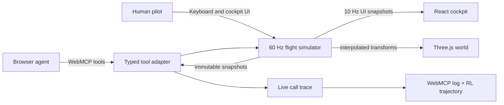

# Flightdeck

Flightdeck is a browser-native evaluation environment where a human and a browser agent share control of a live emergency-flight simulator through WebMCP. The core question is simple: can an agent observe a changing world, make a defensible plan, operate safely over time, and recover when that plan stops working?

**Live app:** [agent-flight-sim-production.up.railway.app](https://agent-flight-sim-production.up.railway.app/)

The aircraft and autopilot run locally in a deterministic 60 Hz fixed-step loop. Three.js renders a procedural airport from the same state exposed to WebMCP. React receives lower-frequency snapshots for instruments and the copilot UI. No map service, Cesium token, webhook, or backend is required.

## Why it is an RL environment

Every WebMCP call forms a transition:

```text
observation → tool action → simulator transition → reward delta → next observation
```

After a terminal state, the app exports both a clean WebMCP call list and a separate `flightdeck-trajectory-v1` JSON file containing observations, actions, results, per-step score changes, latency, terminal flags, final score, and outcome. Seeds 17, 42, and 81 vary weather, engine health, traffic, and passenger urgency while preserving reproducibility.

Judge Mode is a four-minute real-time Concorde evaluation. It keeps the same scoring and WebMCP contract as the full mission, but uses a Concorde-specific terminal envelope, runs the fixed-step simulation at 3×, and uses one turn checkpoint plus base and final. Full Mission remains a ten-minute 1× A380-style run.

### Concorde terminal profile

Judge Mode models a representative high-weight Concorde departure and terminal arrival, not the aircraft's complete supersonic operating envelope. It calls V1 at 150 kt, begins rotation at VR 198 kt, targets V2 220 kt by the 35-foot screen height, then accelerates toward 250 kt in the initial climb. The clean delta wing has no conventional flap settings. Arrival guidance uses 200 kt on base, 175 kt while establishing final, and approximately 165 kt stabilized on approach with a nose-high body attitude.

The values are grounded in the [FAA's Concorde accident record](https://www.faa.gov/lessons_learned/transport_airplane/accidents/F-BTSC), the [FAA-hosted BEA report](https://www.faa.gov/sites/faa.gov/files/2022-11/Concorde_Accident_Report.pdf), [NASA's operational Concorde report](https://ntrs.nasa.gov/api/citations/20180000699/downloads/20180000699.pdf), and [British Airways' Concorde specifications](https://www.britishairways.com/content/information/about-ba/history-and-heritage/celebrating-concorde). Actual V-speeds varied with weight and conditions. Mach 2 cruise and operation near 60,000 ft are intentionally outside this short terminal scenario.

## Architecture



The WebMCP adapter is optional. Browsers without `document.modelContext` retain the complete manual cockpit; only agent control is unavailable.

## WebMCP tools

| Tool | Purpose |
| --- | --- |
| `start_flight` | Start the page-selected mode with a privately selected scenario and take copilot control. |
| `get_mission_brief` | Read the assigned preflight route, airports, runways, deadline, and landing criteria. |
| `get_flight_state` | Read aircraft, navigation, weather, wind, passengers, configuration, score, and route progress. |
| `get_decision_context` | After `emergency_detected`, read the newly available evidence, comfort limits, fuel, decision time, and ranked route options. |
| `inspect_flight_evidence` | Read one or all weather, cockpit, traffic, and passenger reports. |
| `set_route` | File the preflight route or select the emergency route with a reason. |
| `begin_takeoff` | Begin the takeoff roll after route filing. |
| `set_autopilot_targets` | Set persistent heading, altitude, speed, and vertical/lateral modes. |
| `rebuild_active_leg` | Recover a stalled route with a direct intercept, wider pattern, or safe skip. |
| `configure_aircraft` | Set gear and high-lift configuration. Full mode uses simplified A380 flap detents; Concorde Judge mode enforces a clean delta wing with no conventional flaps. |
| `request_human_approval` | Pause a consequential decision while the aircraft keeps flying. |
| `wait_for_flight_event` | Wait without polling for checkpoints, emergencies, configuration, landing, or failure. |
| `transfer_control` | Accept a requested handoff or return control to the pilot. |

The live copilot panel displays tool name, reason, completion state, call latency, summary, and reward change. This makes agent behavior judgeable without opening developer tools.

Every live tool result includes `guidance` with the required action, recommended tool and arguments, allowed tools, current procedure, event revision, and decision time. The scenario seed and future conditions stay out of live WebMCP results. The seed appears only in the completed trajectory so an evaluator can replay the episode.

## Reward and termination

Each episode starts at 100 points. Deductions are event-based and individually listed in the terminal debrief: late emergency decisions, overtime, incorrect configuration, excessive G-load, abrupt control input, hard/off-center landings, and crashes. Passenger distress and deterministic injury probability are separate environment state. Episodes terminate on a safe stop, unsafe touchdown, crash, or fuel exhaustion.

## Run locally

```bash
npm install
npm run dev
```

Open the local URL in a WebMCP-capable browser. Choose Judge Mode for a submission demo or Full Mission for the complete operational episode.

Manual controls: `W/S` pitch, `A/D` bank, arrow keys power, `F` flaps in Full Mission, `G` gear, `X` level attitude, and `T` request/cancel/reclaim agent control. Any direct human flight input immediately overrides the agent.

## Verification

```bash
npm run lint
npm run build
npm run test:sim
npm run benchmark
```

`test:sim` covers wind, drag, stall behavior, takeoff, timer semantics, checkpoints, route recovery, passenger comfort, all three full-mission seeds, both emergency destinations, and all three Judge Mode seeds. See [BENCHMARK.md](./BENCHMARK.md) for the baseline and the 3-model × 3-seed protocol.

## Submission evidence

- Public deployment: Railway URL above.
- Source license: [MIT](./LICENSE).
- Reproducible environment: three fixed seeds and terminal JSON exports.
- Challenge-period history: the repository commit log records the WebMCP tool contract, event waits, route recovery, safety scoring, audio, exports, Judge Mode, and submission documentation as separate commits.

Flightdeck is an interactive research prototype, not a certified aviation-training device.
