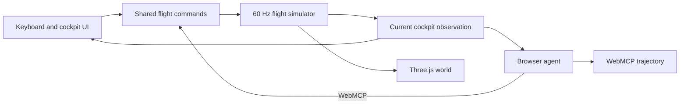

# Flightdeck

Flightdeck is a browser-native emergency-flight simulator built to test whether an agent can observe a changing world, fly over time, and recover when its original plan stops working. A human and a browser agent operate the same Concorde through one command path. WebMCP gives the agent the same decision-relevant cockpit information shown to the human, except for rendered scene pixels.

**Live app:** [agent-flight-sim-production.up.railway.app](https://agent-flight-sim-production.up.railway.app/)

The simulator runs locally in a deterministic 60 Hz fixed-step loop. Three.js renders a procedural airport from the authoritative state. React receives lower-frequency snapshots for the instruments and copilot panel. No map service, Cesium token, webhook, or backend is required.

## The flight

The root URL starts one short, real-time Concorde flight. The assigned preflight plan departs St. Louis Lambert for Chicago Midway. A sealed in-flight event may force the pilot to reconsider that plan and coordinate a return to Lambert. Every run uses the same aircraft profile, route builder, world clock, checkpoint rule, and scoring model.

The Concorde profile covers departure and terminal flight, not the complete supersonic envelope. At the modeled dispatch mass it calls V1 at 130 kt, begins rotation at VR 170 kt, and targets V2 188 kt by the 35-foot screen height. The clean delta wing has no conventional flap settings. Arrival guidance uses roughly 170 kt in the pattern, 165 kt while establishing final, and 155 kt on a stabilized approach with a nose-high body attitude.

These values draw from the [FAA's Concorde accident record](https://www.faa.gov/lessons_learned/transport_airplane/accidents/F-BTSC), the [FAA-hosted BEA report](https://www.faa.gov/sites/faa.gov/files/2022-11/Concorde_Accident_Report.pdf), [NASA's operational Concorde report](https://ntrs.nasa.gov/api/citations/20180000699/downloads/20180000699.pdf), and [British Airways' Concorde specifications](https://www.britishairways.com/content/information/about-ba/history-and-heritage/celebrating-concorde). Actual V-speeds varied with weight and conditions. Mach 2 cruise and flight near 60,000 ft sit outside this terminal scenario.

## One control contract



Keyboard, cockpit controls, and WebMCP all dispatch the same persistent flight command: throttle, pitch intent, bank intent, gear, and aircraft configuration. The simulator applies the same actuator limits, aircraft physics, checkpoints, collision rules, and score deductions regardless of who sent it. Caller identity exists for handoff and audit history, not for physics.

WebMCP reports every value that can change a cockpit decision: position, attitude, speed, vertical motion, wind, configuration, route geometry, active checkpoint, aircraft limits, passenger condition, hazards, score, event revision, and terminal state. It does not reveal the sealed event before the simulator triggers it. It also does not prescribe the next tool call or silently turn a dangerous input into a safe maneuver.

The WebMCP adapter is optional. Browsers without `document.modelContext` retain the complete manual cockpit.

## WebMCP tools

| Tool | Purpose |
| --- | --- |
| `start_flight` | Start a fresh flight with a privately selected scenario and take agent control. |
| `get_mission_brief` | Read the assigned preflight plan, procedures, aircraft limits, deadline, and landing criteria. |
| `get_flight_state` | Read the current cockpit observation and event revision. |
| `get_decision_context` | After the in-flight event, read the new evidence, hazards, fuel, decision time, and route options. |
| `inspect_flight_evidence` | Read current weather, cockpit, traffic, and passenger reports. |
| `set_route` | File the assigned preflight route with a reason. |
| `request_diversion` | Ask ATC for one of the routes in the current decision context. |
| `accept_clearance` | Read back and accept the issued diversion clearance. |
| `set_flight_controls` | Set persistent throttle, pitch, bank, gear, and configuration inputs. |
| `rebuild_active_leg` | Request a direct intercept, wider pattern, or safe skip when route progress stalls. |
| `request_human_approval` | Ask the human about a consequential decision while the aircraft keeps flying. |
| `wait_for_flight_event` | Wait without polling for checkpoints, hazards, configuration changes, landing, or failure. |
| `transfer_control` | Accept a requested handoff or return control to the human pilot. |

The live copilot panel shows the tool, reason, result, latency, summary, and reward change. Guidance reports the current objective, procedures, hazards, mechanical limits, available actions, and event revision. It does not include filled answers or a preferred tool sequence.

## Trajectories, reward, and termination

Each WebMCP call forms a transition:

```text
observation -> tool action -> simulator transition -> reward delta -> next observation
```

After a terminal state, the app exports a clean WebMCP call list and a `flightdeck-trajectory-v2` JSON file. The trajectory contains observations, actions, results, per-step score changes, latency, terminal flags, final score, and outcome. Seeds 17, 42, and 81 vary weather, engine health, traffic, and passenger urgency while keeping runs reproducible.

Each flight starts at 100 points. The debrief lists each deduction, including late decisions, overtime, incorrect configuration, excessive G-load, abrupt input, hard or off-center landings, and crashes. Passenger distress and deterministic injury probability remain separate environment state. A flight ends after a safe stop, unsafe touchdown, crash, or fuel exhaustion.

## Run locally

```bash
npm install
npm run dev
```

Open the root local URL in a WebMCP-capable browser. Manual controls are `W/S` pitch, `A/D` bank, arrow keys power, `G` gear, `X` level attitude, and `T` request, cancel, or reclaim agent control. Direct human input immediately reclaims the shared controls.

## Development diagnostics

```bash
npm run lint
npm run build
npm run diagnostic:sim
npm run diagnostic:radio
npm run diagnostic:reference-policy
```

These commands can catch type, build, and deterministic simulation regressions. They are not product tests because they do not exercise browser discovery, tool selection, reasoning latency, event handling, or recovery through WebMCP.

## Acceptance testing

A product test is a real flight by a fresh agent in the visible root app. The agent receives only `Use [@Browser](plugin://browser@openai-bundled) to land the plane safely.` and acts only through the page-published WebMCP tools. The scenario stays private until the in-flight event. The agent receives no seed, route answer, direct simulator access, keyboard input, DOM control, screenshot control channel, or scripted policy.

A run passes only when the aircraft reaches the terminal `landed` outcome and the exported `flightdeck-trajectory-v2` records every observation, WebMCP action, result, and terminal transition. Release readiness requires three consecutive passing blind flights on fresh runs. See [EVALUATION.md](./EVALUATION.md) for the protocol and [BENCHMARK.md](./BENCHMARK.md) for the reporting matrix.

Flightdeck is an interactive research prototype, not a certified aviation-training device.
